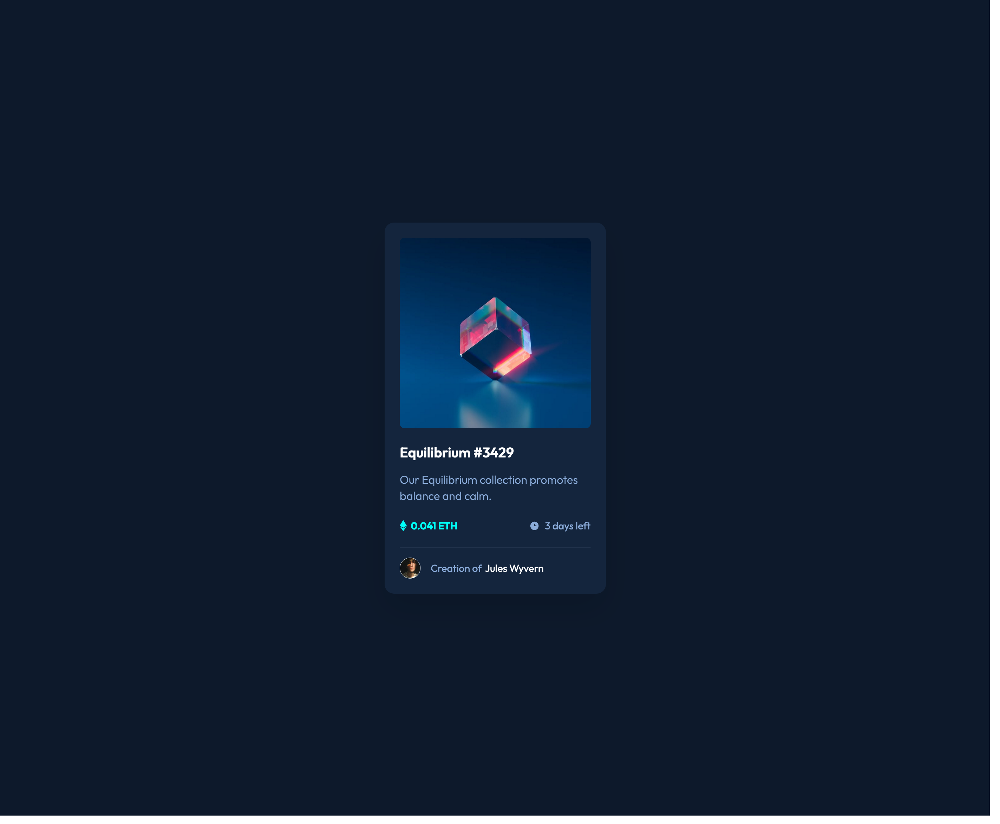

# Frontend Mentor - NFT preview card component solution

This is a solution to the [NFT preview card component challenge on Frontend Mentor](https://www.frontendmentor.io/challenges/nft-preview-card-component-SbdUL_w0U). Frontend Mentor challenges help you improve your coding skills by building realistic projects. 

## Table of contents

- [Overview](#overview)
  - [The challenge](#the-challenge)
  - [Screenshot](#screenshot)
  - [Links](#links)
- [My process](#my-process)
  - [Built with](#built-with)
  - [What I learned](#what-i-learned)
  - [Useful resources](#useful-resources)
- [Author](#author)
- [Acknowledgments](#acknowledgments)

## Overview

### The challenge

Users should be able to:

- View the optimal layout depending on their device's screen size
- See hover states for interactive elements

### Screenshot

### Links

- Solution URL: [Github](https://github.com/kwonmoon/nft-preview-card-component-main)
- Live Site URL: [Netlify](https://joyful-truffle-664fe7.netlify.app/)

## My process

### Built with

- Semantic HTML5 markup
- CSS custom properties
- Flexbox
- Sass

### What I learned

- I tried Sass with BEM design. It's kind of confusing in the begining, but I think it's good system expecially responsive design.

### Useful resources

- [Writing Cleaner CSS using BEM](https://israelmitolu.hashnode.dev/writing-cleaner-css-using-bem-methodology) - This helped me to capture the concept of BEM design.

## Author

- Frontend Mentor - [@kwonmoon](https://www.frontendmentor.io/profile/kwonmoon)

## Acknowledgments

- Blog by Israel Oyetunji helped me to understand the basic of BEM design.